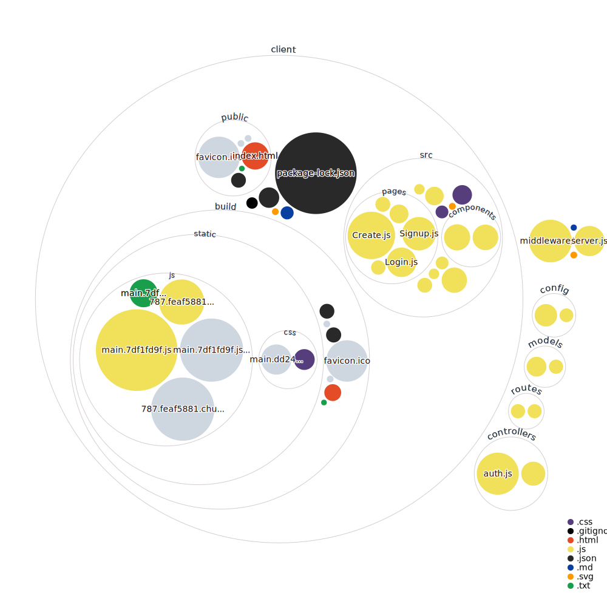

# Caesura - Poetry Remixer
Create your own art by remixing classic poems!

**Link to project:** https://caesura-poem-remixer.herokuapp.com/

## How It's Made:

**Tech used:** React, NodeJS, Express, MongoDB, Passport

The frontend client is built in React, and the backend is built with Node.js, Express, and MongoDB. 

The frontend pulls poem data from the Poetry database API at https://github.com/thundercomb/poetrydb#readme, and then provides it to the user in batches of three. The user selects one of the three choices for each batch, and that adds the selected line to their remixed poem. When the poem is done, the app gives the user choices between 5 randomized words taken from the titles of all the selected poems. Once the user has created their remixed poem, they click the "Create" button, and the frontend sends that data to the server, which processes the request and adds the poem data to the MongoDB database. 

Users can then access a feed of all created poems, or a profile list of all the poems they have created. From the profile list, they can delete poems they have created.

Uses the Passport Local Auth strategy to manage user sessions. Users can login and signup through the login/signup pages, and the server authenticates them using the Local Auth strategy and stores their sessions in the database.

## Optimizations

I'm looking forward to expanding and optimizing this when time allows!
Upcoming features:
-Users can comment on poems with randomized mini-poems
-Expanded poem database
-Users can like poems
-Users can remix other users' poems

## Lessons Learned:

MERN stack apps can do almost anything. The sky truly is the limit, and I can't wait to push this to even more zany heights!
I had way more fun making this app then I initally expected. The process of making remixed poems is genuinely hilarious!
I really enjoyed the process of hooking up the frontend and the backend and getting requests moving between them. It was definitely not the thing that I thought I would enjoy most!

